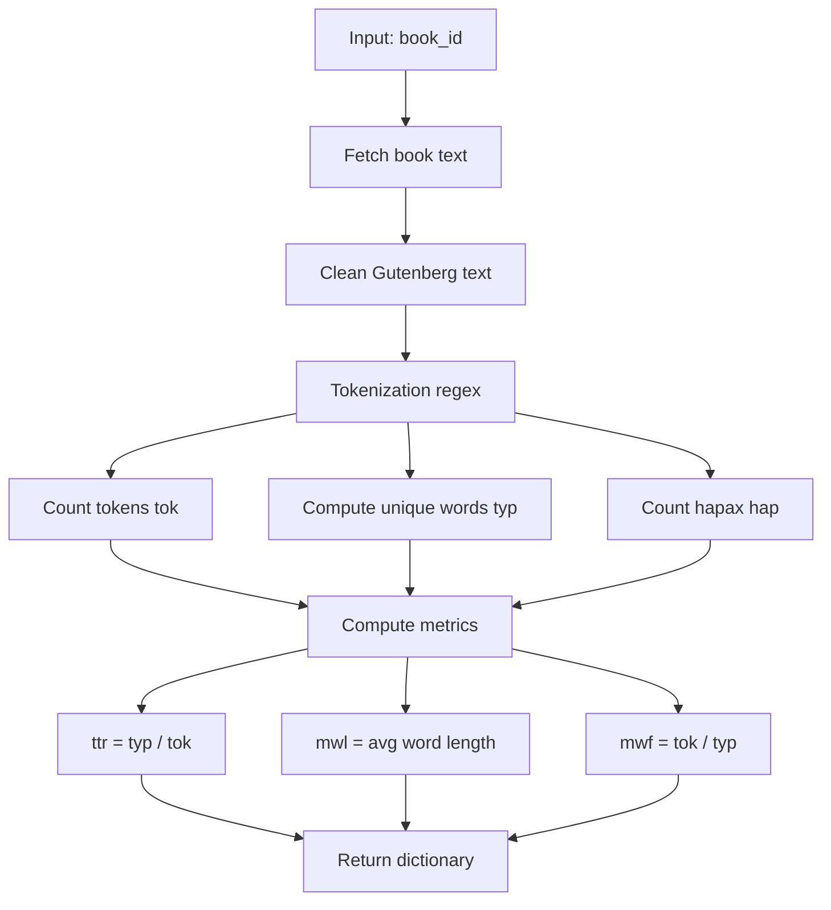
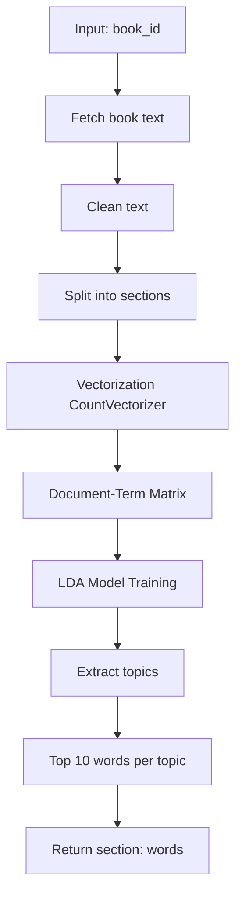
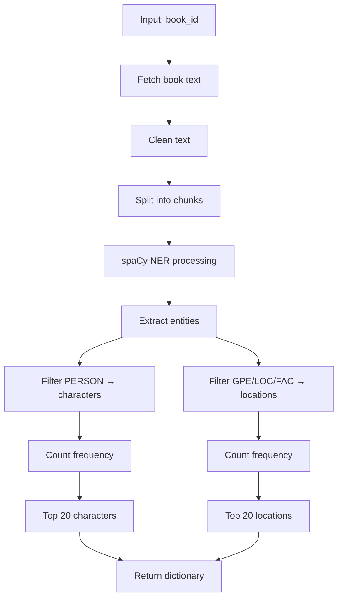
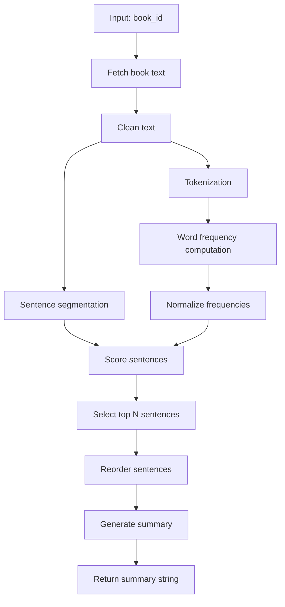
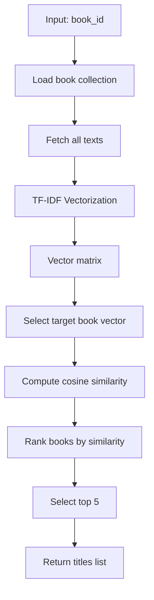
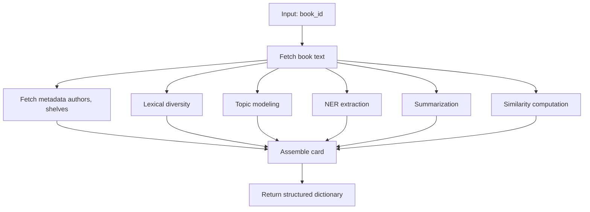

# Bookworm NLP Pipelines

This document presents the main Natural Language Processing (NLP) pipelines implemented in `bookworm.py`.

# 1. Lexical Diversity Pipeline

Evaluates vocabulary richness and writing style.

# 2. Topic Modeling Pipeline

Extracts main themes using LDA.

# 3. Named Entity Recognition (NER) Pipeline

Identifies characters and locations using spaCy.

# 4. Book Summarization Pipeline

Generates extractive summaries using sentence scoring.

# 5. Book Similarity Pipeline

Finds similar books using TF-IDF and cosine similarity.

# 6. Book Card Pipeline

Aggregates all features into a structured metadata object.

